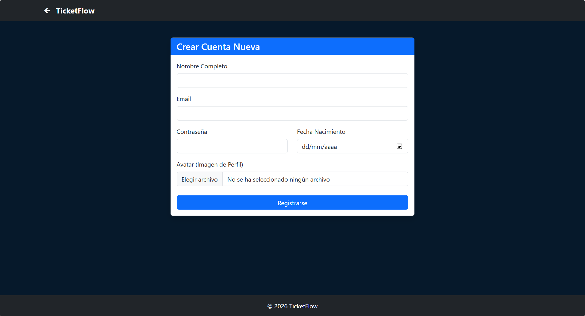
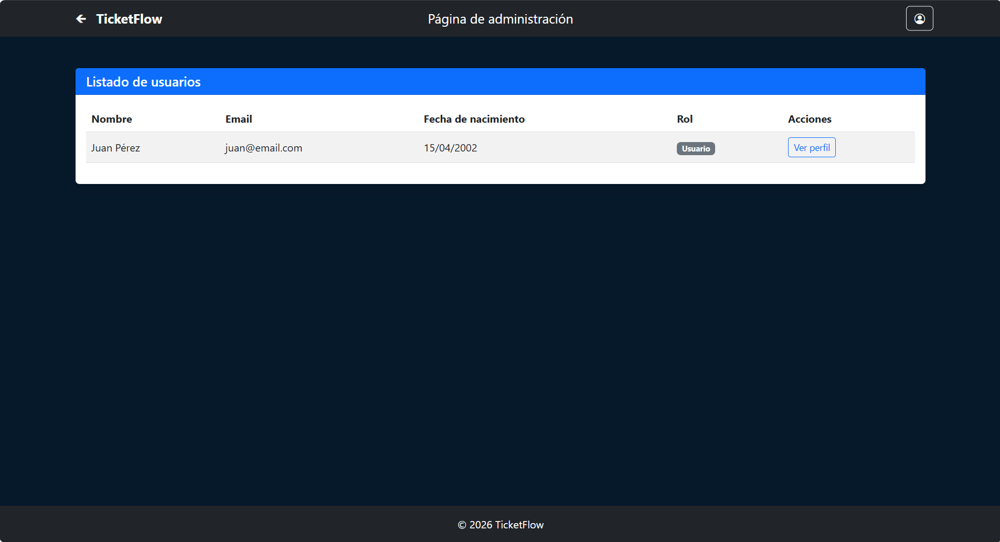

# [Nombre de la Aplicación]

## 👥 Miembros del Equipo
| Nombre y Apellidos          | Correo URJC | Usuario GitHub |
|:----------------------------|:--- |:--- |
| Lázaro Martínez Medina      | l.martinezm.2023@alumnos.urjc.es | Lazaro-123 |
| Pablo Leis Aguado           | p.leis.2023@alumnos.urjc.es | pabloleis7 |
| Alejandro Cabello Manzanero | a.cabellom.2023@alumnos.urjc.es | cabeee |
| Eduardo José Narros Sánchez | ej.narros.2023@alumnos.urjc.es | eeduunrrs2 |

---

## 🎭 **Preparación: Definición del Proyecto**

### **Descripción del Tema**
TicketFlow es una plataforma centralizada de gestión y venta directa de entradas para el sector del ocio nocturno. Su objetivo es conectar a las discotecas con su público objetivo a través de un proceso de compra simplificado, eliminando intermediarios innecesarios y ofreciendo una experiencia de usuario fluida y segura.

### **Entidades**

1. [Entidad 1]: Usuario (Compradores, vendedores y administradores).
2. [Entidad 2]: Evento (La fiesta o sesión de la discoteca con fecha, lugar y descripción).
3. [Entidad 3]: Entrada / Ticket (La unidad que se vende; incluye código QR/ID, precio y estado).
4. [Entidad 4]: Discoteca / Sala (El recinto donde ocurren los eventos).
5. [Entidad 5]: Transacción / Pedido (El registro del pago y cambio de propiedad).

**Relaciones entre entidades:**
- [Usuario - Entrada: Un usuario puede poner a la venta múltiples entradas o haber comprado varias. (1:N)]
- [Evento - Entrada: Un evento específico tiene muchas entradas asociadas. (1:N)]
- [Discoteca - Evento: Una discoteca organiza muchos eventos a lo largo del tiempo. (1:N)]
- [Usuario - Transaccion: Un usuario (comprador) genera una transacción al comprar, pero una transacción involucra a un comprador y un vendedor. (1:N)]
- [Entrada - Transacción: En un modelo de reventa, cada transacción suele validar el traspaso de una entrada específica. (1:1)]

### **Permisos de los Usuarios**
Describir los permisos de cada tipo de usuario e indicar de qué entidades es dueño:

* **Usuario Anónimo**: 
  - Permisos: Visualización de próximos eventos, filtrado por discoteca o ciudad, ver precios de entradas disponibles y registro/login.
  - Dueño de: Nada

* **Usuario Registrado**: 
  - Permisos: Comprar entradas, descargar entradas compradas, gestionar su perfil y ver historial de compras/ventas.
  - Es dueño de: Sus entradas publicadas, sus transacciones (como comprador o vendedor) y sus datos de perfil.

* **Administrador**: 
  - Permisos: Validación de autenticidad de entradas, banear usuarios fraudulentos, crear/editar discotecas y eventos y visualizar métricas de ventas.
  - Es dueño de: La base de datos de Discotecas y Eventos, y tiene control total sobre el estado de las Entradas.

### **Imágenes**
Indicar qué entidades tendrán asociadas una o varias imágenes:

- **[Entidad con imágenes 1]**:  Una imagen de perfil o avatar
- **[Entidad con imágenes 2]**:  Evento - Cartel publicitario del evento (flyer) en alta resolución
- **[Entidad con imágenes 3]**:  Discoteca - Logo de la sala y fotos del recinto para generar confianza
- **[Entidad con imágenes 4]**:  Entrada - Miniatura del QR (solo visible tras la compra) o captura de pantalla del ticket original para validación interna del admin

---

## 🛠 **Práctica 1: Maquetación de páginas con HTML y CSS**

### **Vídeo de Demostración**
📹 **[Enlace al vídeo en YouTube](https://www.youtube.com/watch?v=x91MPoITQ3I)**
> Vídeo mostrando las principales funcionalidades de la aplicación web.

### **Diagrama de Navegación**
Diagrama que muestra cómo se navega entre las diferentes páginas de la aplicación:


> 

### **Capturas de Pantalla y Descripción de Páginas**

#### **1. Página Principal / Home**


> Maqueta de la página de aterrizaje que sirve como punto de entrada. Presenta un diseño oscuro con un banner hero que utiliza una imagen inmersiva y el eslogan "Vive la noche". En la parte inferior, se muestra una cuadrícula estática de "Próximos Eventos" con tarjetas que incluyen el nombre del evento, la sala y la fecha. Además cuenta con enlaces de login, registro y perfil, todo de forma estática.

#### **2. Login**

> Interfaz de autenticación diseñada con un enfoque minimalista. Contiene un contenedor central blanco sobre el fondo oscuro corporativo, con campos de texto para el Email y la Contraseña. Incluye un botón destacado de "Entrar" y un enlace de redirección para usuarios no registrados.

#### **3. Registro de cuenta**

> Formulario estático para la creación de nuevos perfiles. Permite visualizar la disposición de los campos de Nombre Completo, Email, Contraseña y un selector de Fecha de Nacimiento. También integra una sección para la carga de archivos, destinada a la imagen de Avatar del usuario.

#### **4. Perfil de Usuario y Edición**

> El área personal se divide en dos vistas clave:

    - Mi Perfil: Muestra cómo se visualizarán los datos del usuario, sus entradas activas (con etiquetas de estado como "Activa") y un historial de transacciones pasadas.

    - Modificar Datos: Una interfaz de formulario pre-rellenada que simula la capacidad de actualizar la información personal, cambiar la contraseña o sustituir el avatar actual.

#### **6.Panel de Administración de Usuarios**

> Vista centralizada para el administrador del sitio. Presenta una tabla de datos que organiza a los usuarios por nombre, correo electrónico y fecha de nacimiento. Incluye una columna de Rol con etiquetas visuales (ej. "Usuario") y un botón de acción para gestionar cada perfil de forma individual.


#### **7. Gestión de Discotecas**

> Vistas administrativas para el control de los locales nocturnos:

    - Registro: Formulario detallado que incluye campos para el Aforo Máximo, Precio Medio y una descripción del ambiente o estilo de música.

    - Edición: Una versión simplificada de la interfaz diseñada para actualizar rápidamente el nombre o la imagen representativa de la discoteca.

#### **8. Gestión de Eventos y entradas**

> Visualización de la oferta comercial de un evento específico (ej. "White Night"):

    - Vista de Detalle: Diseño que desglosa los diferentes tipos de pases disponibles (Early White, Main Night, White VIP) mostrando sus precios, qué incluyen (copas, zonas VIP) y botones de gestión.

    - Gestión de Ticketing: Maquetas de los formularios para crear o modificar las condiciones de acceso y el coste de cada tipo de entrada.

#### **9. Creación y Edición de Eventos**

> Interfaces diseñadas para la planificación de fiestas. Permiten simular la vinculación de un evento a una discoteca existente del listado y la subida de la imagen promocional o cartel del evento.

### **Participación de Miembros en la Práctica 1**

#### **Alumno 1 - [Nombre Completo]**

[Descripción de las tareas y responsabilidades principales del alumno en el proyecto]

| Nº    | Commits      | Files      |
|:------------: |:------------:| :------------:|
|1| [Descripción commit 1](URL_commit_1)  | [Archivo1](URL_archivo_1)   |
|2| [Descripción commit 2](URL_commit_2)  | [Archivo2](URL_archivo_2)   |
|3| [Descripción commit 3](URL_commit_3)  | [Archivo3](URL_archivo_3)   |
|4| [Descripción commit 4](URL_commit_4)  | [Archivo4](URL_archivo_4)   |
|5| [Descripción commit 5](URL_commit_5)  | [Archivo5](URL_archivo_5)   |

---

#### **Alumno 2 - [Nombre Completo]**

[Descripción de las tareas y responsabilidades principales del alumno en el proyecto]

| Nº    | Commits      | Files      |
|:------------: |:------------:| :------------:|
|1| [Descripción commit 1](URL_commit_1)  | [Archivo1](URL_archivo_1)   |
|2| [Descripción commit 2](URL_commit_2)  | [Archivo2](URL_archivo_2)   |
|3| [Descripción commit 3](URL_commit_3)  | [Archivo3](URL_archivo_3)   |
|4| [Descripción commit 4](URL_commit_4)  | [Archivo4](URL_archivo_4)   |
|5| [Descripción commit 5](URL_commit_5)  | [Archivo5](URL_archivo_5)   |

---

#### **Alumno 3 - [Nombre Completo]**

[Descripción de las tareas y responsabilidades principales del alumno en el proyecto]

| Nº    | Commits      | Files      |
|:------------: |:------------:| :------------:|
|1| [Descripción commit 1](URL_commit_1)  | [Archivo1](URL_archivo_1)   |
|2| [Descripción commit 2](URL_commit_2)  | [Archivo2](URL_archivo_2)   |
|3| [Descripción commit 3](URL_commit_3)  | [Archivo3](URL_archivo_3)   |
|4| [Descripción commit 4](URL_commit_4)  | [Archivo4](URL_archivo_4)   |
|5| [Descripción commit 5](URL_commit_5)  | [Archivo5](URL_archivo_5)   |

---

#### **Alumno 4 - [Nombre Completo]**

[Descripción de las tareas y responsabilidades principales del alumno en el proyecto]

| Nº    | Commits      | Files      |
|:------------: |:------------:| :------------:|
|1| [Descripción commit 1](URL_commit_1)  | [Archivo1](URL_archivo_1)   |
|2| [Descripción commit 2](URL_commit_2)  | [Archivo2](URL_archivo_2)   |
|3| [Descripción commit 3](URL_commit_3)  | [Archivo3](URL_archivo_3)   |
|4| [Descripción commit 4](URL_commit_4)  | [Archivo4](URL_archivo_4)   |
|5| [Descripción commit 5](URL_commit_5)  | [Archivo5](URL_archivo_5)   |

---

## 🛠 **Práctica 2: Web con HTML generado en servidor**

### **Vídeo de Demostración**
📹 **[Enlace al vídeo en YouTube](https://www.youtube.com/watch?v=x91MPoITQ3I)**
> Vídeo mostrando las principales funcionalidades de la aplicación web.

### **Navegación y Capturas de Pantalla**

#### **Diagrama de Navegación**

Solo si ha cambiado.

#### **Capturas de Pantalla Actualizadas**

Solo si han cambiado.

### **Instrucciones de Ejecución**

#### **Requisitos Previos**
- **Java**: versión 21 o superior
- **Maven**: versión 3.8 o superior
- **MySQL**: versión 8.0 o superior
- **Git**: para clonar el repositorio

#### **Pasos para ejecutar la aplicación**

1. **Clonar el repositorio**
   ```bash
   git clone https://github.com/[usuario]/[nombre-repositorio].git
   cd [nombre-repositorio]
   ```

2. **AQUÍ INDICAR LO SIGUIENTES PASOS**

#### **Credenciales de prueba**
- **Usuario Admin**: usuario: `admin`, contraseña: `admin`
- **Usuario Registrado**: usuario: `user`, contraseña: `user`

### **Diagrama de Entidades de Base de Datos**

Diagrama mostrando las entidades, sus campos y relaciones:


> [Descripción opcional: Ej: "El diagrama muestra las 4 entidades principales: Usuario, Producto, Pedido y Categoría, con sus respectivos atributos y relaciones 1:N y N:M."]

### **Diagrama de Clases y Templates**

Diagrama de clases de la aplicación con diferenciación por colores o secciones:


> [Descripción opcional del diagrama y relaciones principales]

### **Participación de Miembros en la Práctica 2**

#### **Alumno 1 - [Nombre Completo]**

[Descripción de las tareas y responsabilidades principales del alumno en el proyecto]

| Nº    | Commits      | Files      |
|:------------: |:------------:| :------------:|
|1| [Descripción commit 1](URL_commit_1)  | [Archivo1](URL_archivo_1)   |
|2| [Descripción commit 2](URL_commit_2)  | [Archivo2](URL_archivo_2)   |
|3| [Descripción commit 3](URL_commit_3)  | [Archivo3](URL_archivo_3)   |
|4| [Descripción commit 4](URL_commit_4)  | [Archivo4](URL_archivo_4)   |
|5| [Descripción commit 5](URL_commit_5)  | [Archivo5](URL_archivo_5)   |

---

#### **Alumno 2 - [Nombre Completo]**

[Descripción de las tareas y responsabilidades principales del alumno en el proyecto]

| Nº    | Commits      | Files      |
|:------------: |:------------:| :------------:|
|1| [Descripción commit 1](URL_commit_1)  | [Archivo1](URL_archivo_1)   |
|2| [Descripción commit 2](URL_commit_2)  | [Archivo2](URL_archivo_2)   |
|3| [Descripción commit 3](URL_commit_3)  | [Archivo3](URL_archivo_3)   |
|4| [Descripción commit 4](URL_commit_4)  | [Archivo4](URL_archivo_4)   |
|5| [Descripción commit 5](URL_commit_5)  | [Archivo5](URL_archivo_5)   |

---

#### **Alumno 3 - [Nombre Completo]**

[Descripción de las tareas y responsabilidades principales del alumno en el proyecto]

| Nº    | Commits      | Files      |
|:------------: |:------------:| :------------:|
|1| [Descripción commit 1](URL_commit_1)  | [Archivo1](URL_archivo_1)   |
|2| [Descripción commit 2](URL_commit_2)  | [Archivo2](URL_archivo_2)   |
|3| [Descripción commit 3](URL_commit_3)  | [Archivo3](URL_archivo_3)   |
|4| [Descripción commit 4](URL_commit_4)  | [Archivo4](URL_archivo_4)   |
|5| [Descripción commit 5](URL_commit_5)  | [Archivo5](URL_archivo_5)   |

---

#### **Alumno 4 - [Nombre Completo]**

[Descripción de las tareas y responsabilidades principales del alumno en el proyecto]

| Nº    | Commits      | Files      |
|:------------: |:------------:| :------------:|
|1| [Descripción commit 1](URL_commit_1)  | [Archivo1](URL_archivo_1)   |
|2| [Descripción commit 2](URL_commit_2)  | [Archivo2](URL_archivo_2)   |
|3| [Descripción commit 3](URL_commit_3)  | [Archivo3](URL_archivo_3)   |
|4| [Descripción commit 4](URL_commit_4)  | [Archivo4](URL_archivo_4)   |
|5| [Descripción commit 5](URL_commit_5)  | [Archivo5](URL_archivo_5)   |

---

## 🛠 **Práctica 3: Incorporación de una API REST a la aplicación web, análisis de vulnerabilidades y contramedidas**

### **Vídeo de Demostración**
📹 **[Enlace al vídeo en YouTube](https://www.youtube.com/watch?v=x91MPoITQ3I)**
> Vídeo mostrando las principales funcionalidades de la aplicación web.

### **Documentación de la API REST**

#### **Especificación OpenAPI**
📄 **[Especificación OpenAPI (YAML)](/api-docs/api-docs.yaml)**

#### **Documentación HTML**
📖 **[Documentación API REST (HTML)](https://raw.githack.com/[usuario]/[repositorio]/main/api-docs/api-docs.html)**

> La documentación de la API REST se encuentra en la carpeta `/api-docs` del repositorio. Se ha generado automáticamente con SpringDoc a partir de las anotaciones en el código Java.

### **Diagrama de Clases y Templates Actualizado**

Diagrama actualizado incluyendo los @RestController y su relación con los @Service compartidos:


#### **Credenciales de Usuarios de Ejemplo**

| Rol | Usuario | Contraseña |
|:---|:---|:---|
| Administrador | admin | admin123 |
| Usuario Registrado | user1 | user123 |
| Usuario Registrado | user2 | user123 |

### **Participación de Miembros en la Práctica 3**

#### **Alumno 1 - [Nombre Completo]**

[Descripción de las tareas y responsabilidades principales del alumno en el proyecto]

| Nº    | Commits      | Files      |
|:------------: |:------------:| :------------:|
|1| [Descripción commit 1](URL_commit_1)  | [Archivo1](URL_archivo_1)   |
|2| [Descripción commit 2](URL_commit_2)  | [Archivo2](URL_archivo_2)   |
|3| [Descripción commit 3](URL_commit_3)  | [Archivo3](URL_archivo_3)   |
|4| [Descripción commit 4](URL_commit_4)  | [Archivo4](URL_archivo_4)   |
|5| [Descripción commit 5](URL_commit_5)  | [Archivo5](URL_archivo_5)   |

---

#### **Alumno 2 - [Nombre Completo]**

[Descripción de las tareas y responsabilidades principales del alumno en el proyecto]

| Nº    | Commits      | Files      |
|:------------: |:------------:| :------------:|
|1| [Descripción commit 1](URL_commit_1)  | [Archivo1](URL_archivo_1)   |
|2| [Descripción commit 2](URL_commit_2)  | [Archivo2](URL_archivo_2)   |
|3| [Descripción commit 3](URL_commit_3)  | [Archivo3](URL_archivo_3)   |
|4| [Descripción commit 4](URL_commit_4)  | [Archivo4](URL_archivo_4)   |
|5| [Descripción commit 5](URL_commit_5)  | [Archivo5](URL_archivo_5)   |

---

#### **Alumno 3 - [Nombre Completo]**

[Descripción de las tareas y responsabilidades principales del alumno en el proyecto]

| Nº    | Commits      | Files      |
|:------------: |:------------:| :------------:|
|1| [Descripción commit 1](URL_commit_1)  | [Archivo1](URL_archivo_1)   |
|2| [Descripción commit 2](URL_commit_2)  | [Archivo2](URL_archivo_2)   |
|3| [Descripción commit 3](URL_commit_3)  | [Archivo3](URL_archivo_3)   |
|4| [Descripción commit 4](URL_commit_4)  | [Archivo4](URL_archivo_4)   |
|5| [Descripción commit 5](URL_commit_5)  | [Archivo5](URL_archivo_5)   |

---

#### **Alumno 4 - [Nombre Completo]**

[Descripción de las tareas y responsabilidades principales del alumno en el proyecto]

| Nº    | Commits      | Files      |
|:------------: |:------------:| :------------:|
|1| [Descripción commit 1](URL_commit_1)  | [Archivo1](URL_archivo_1)   |
|2| [Descripción commit 2](URL_commit_2)  | [Archivo2](URL_archivo_2)   |
|3| [Descripción commit 3](URL_commit_3)  | [Archivo3](URL_archivo_3)   |
|4| [Descripción commit 4](URL_commit_4)  | [Archivo4](URL_archivo_4)   |
|5| [Descripción commit 5](URL_commit_5)  | [Archivo5](URL_archivo_5)   |
