# [Nombre de la Aplicación]

## 👥 Miembros del Equipo
| Nombre y Apellidos          | Correo URJC | Usuario GitHub |
|:----------------------------|:--- |:--- |
| Lázaro Martínez Medina      | l.martinezm.2023@alumnos.urjc.es | Lazaro-123 |
| Pablo Leis Aguado           | p.leis.2023@alumnos.urjc.es | pabloleis7 |
| Alejandro Cabello Manzanero | a.cabellom.2023@alumnos.urjc.es | cabeee |
| Eduardo José Narros Sánchez | ej.narros.2023@alumnos.urjc.es | eeduunrrs2 |

---

## 🎭 **Preparación: Definición del Proyecto**

### **Descripción del Tema**
TicketFlow es una plataforma centralizada de gestión y venta directa de entradas para el sector del ocio nocturno. Su objetivo es conectar a las discotecas con su público objetivo a través de un proceso de compra simplificado, eliminando intermediarios innecesarios y ofreciendo una experiencia de usuario fluida y segura.

### **Entidades**

1. [Entidad 1]: Usuario (Compradores, vendedores y administradores).
2. [Entidad 2]: Evento (La fiesta o sesión de la discoteca con fecha, lugar y descripción).
3. [Entidad 3]: Entrada / Ticket (La unidad que se vende; incluye código QR/ID, precio y estado).
4. [Entidad 4]: Discoteca / Sala (El recinto donde ocurren los eventos).
5. [Entidad 5]: Transacción / Pedido (El registro del pago y cambio de propiedad).

**Relaciones entre entidades:**
- [Usuario - Entrada: Un usuario puede poner a la venta múltiples entradas o haber comprado varias. (1:N)]
- [Evento - Entrada: Un evento específico tiene muchas entradas asociadas. (1:N)]
- [Discoteca - Evento: Una discoteca organiza muchos eventos a lo largo del tiempo. (1:N)]
- [Usuario - Transaccion: Un usuario (comprador) genera una transacción al comprar, pero una transacción involucra a un comprador y un vendedor. (1:N)]
- [Entrada - Transacción: En un modelo de reventa, cada transacción suele validar el traspaso de una entrada específica. (1:1)]

### **Permisos de los Usuarios**
Describir los permisos de cada tipo de usuario e indicar de qué entidades es dueño:

* **Usuario Anónimo**: 
  - Permisos: Visualización de próximos eventos, filtrado por discoteca o ciudad, ver precios de entradas disponibles y registro/login.
  - Dueño de: Nada

* **Usuario Registrado**: 
  - Permisos: Comprar entradas, descargar entradas compradas, gestionar su perfil y ver historial de compras/ventas.
  - Es dueño de: Sus entradas publicadas, sus transacciones (como comprador o vendedor) y sus datos de perfil.

* **Administrador**: 
  - Permisos: Validación de autenticidad de entradas, banear usuarios fraudulentos, crear/editar discotecas y eventos y visualizar métricas de ventas.
  - Es dueño de: La base de datos de Discotecas y Eventos, y tiene control total sobre el estado de las Entradas.

### **Imágenes**
Indicar qué entidades tendrán asociadas una o varias imágenes:

- **[Entidad con imágenes 1]**:  Una imagen de perfil o avatar
- **[Entidad con imágenes 2]**:  Evento - Cartel publicitario del evento (flyer) en alta resolución
- **[Entidad con imágenes 3]**:  Discoteca - Logo de la sala y fotos del recinto para generar confianza
- **[Entidad con imágenes 4]**:  Entrada - Miniatura del QR (solo visible tras la compra) o captura de pantalla del ticket original para validación interna del admin

---

## 🛠 **Práctica 1: Maquetación de páginas con HTML y CSS**

### **Vídeo de Demostración**
📹 **[Enlace al vídeo en YouTube](https://youtu.be/Jb5KAtdK15g)**
> Vídeo mostrando las principales funcionalidades de la aplicación web.

### **Diagrama de Navegación**
Diagrama que muestra cómo se navega entre las diferentes páginas de la aplicación:

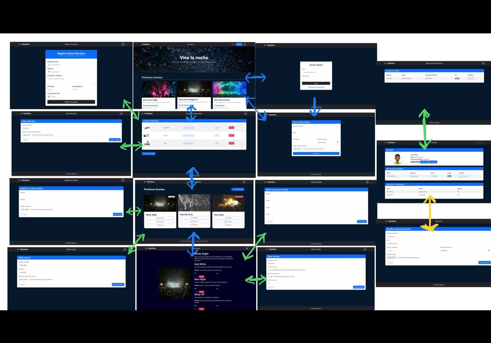

> Leyenda: azul-todos los usuarios, verde-admin, amarillo-usuarios registrados. 
> Aclaración 1: podemos ir desde todas las páginas a la página principal (index.png)
> Aclaración 2: podemos ir desde cualquier página menos la de login y la de registro al perfil del usuario (profile.png) siempre y cuando se esté registrado o se sea admin
> Aclaración 3: justo después de hacer el diagrama de navegación modificamos el html de añadir discoteca entonces la página que aparece en el diagrama es ligeramente distinta a la que tenemos ahora
### **Capturas de Pantalla y Descripción de Páginas**

#### **1. Página Principal / Home**
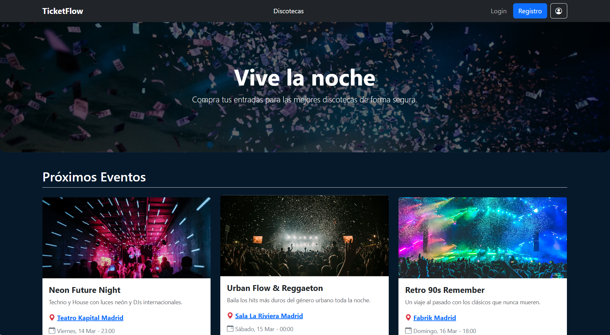 

> Maqueta de la página de aterrizaje que sirve como punto de entrada. Presenta un diseño oscuro con un banner hero que utiliza una imagen inmersiva y el eslogan "Vive la noche". En la parte inferior, se muestra una cuadrícula estática de "Próximos Eventos" con tarjetas que incluyen el nombre del evento, la sala y la fecha. Además cuenta con enlaces de login, registro y perfil, todo de forma estática.

#### **2. Login**
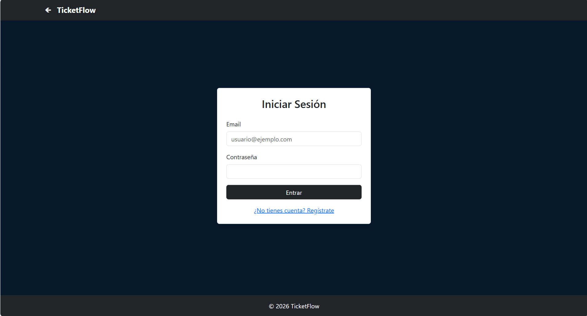
> Interfaz de autenticación diseñada con un enfoque minimalista. Contiene un contenedor central blanco sobre el fondo oscuro corporativo, con campos de texto para el Email y la Contraseña. Incluye un botón destacado de "Entrar" y un enlace de redirección para usuarios no registrados.

#### **3. Registro de cuenta**
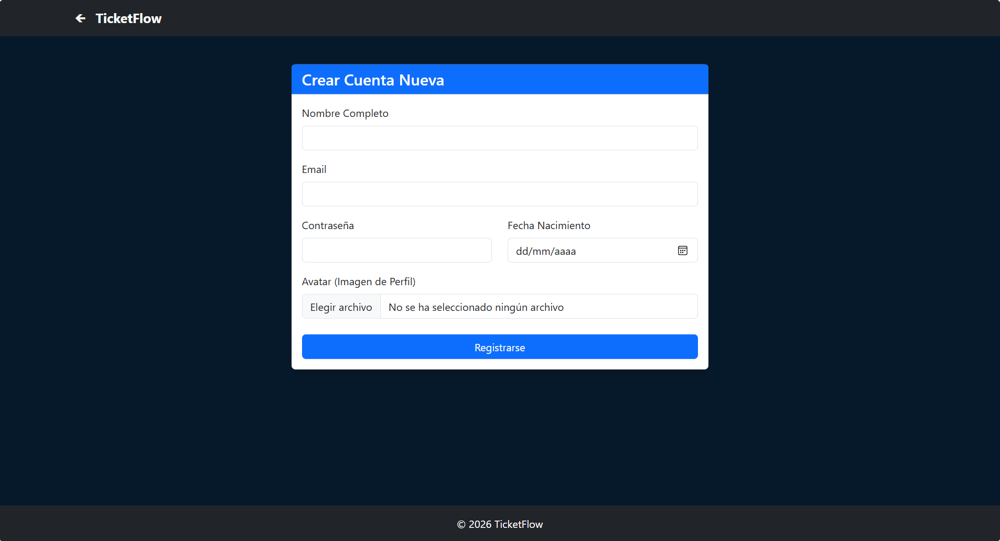
> Formulario estático para la creación de nuevos perfiles. Permite visualizar la disposición de los campos de Nombre Completo, Email, Contraseña y un selector de Fecha de Nacimiento. También integra una sección para la carga de archivos, destinada a la imagen de Avatar del usuario.

#### **4. Perfil de Usuario y Edición**
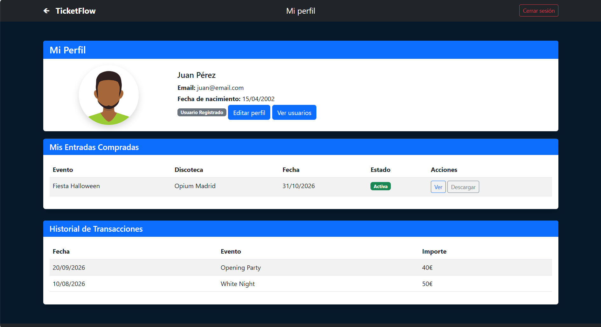
> El área personal se divide en dos vistas clave:

    - Mi Perfil: Muestra cómo se visualizarán los datos del usuario, sus entradas activas (con etiquetas de estado como "Activa") y un historial de transacciones pasadas.

    - Modificar Datos: Una interfaz de formulario pre-rellenada que simula la capacidad de actualizar la información personal, cambiar la contraseña o sustituir el avatar actual.

#### **6.Panel de Administración de Usuarios**
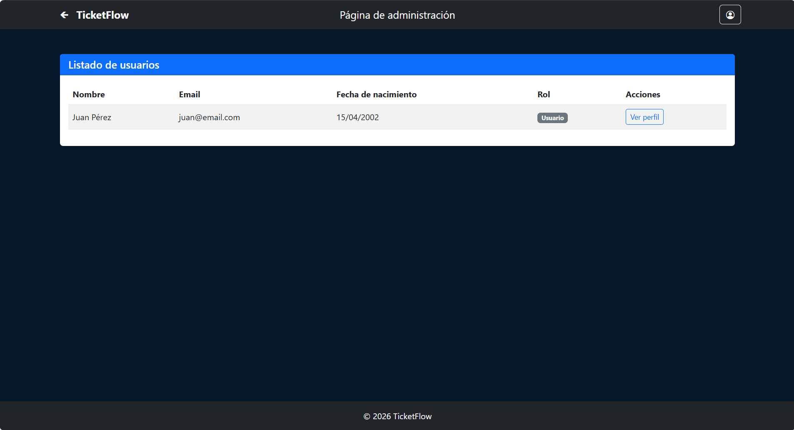
> Vista centralizada para el administrador del sitio. Presenta una tabla de datos que organiza a los usuarios por nombre, correo electrónico y fecha de nacimiento. Incluye una columna de Rol con etiquetas visuales (ej. "Usuario") y un botón de acción para gestionar cada perfil de forma individual.


#### **7. Gestión de Discotecas**
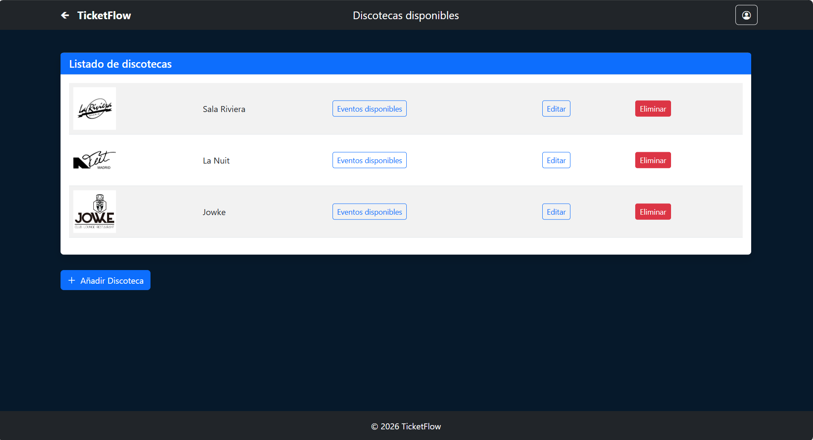
> Vistas administrativas para el control de los locales nocturnos:

    - Registro: Formulario detallado que incluye campos para el Aforo Máximo, Precio Medio y una descripción del ambiente o estilo de música.

    - Edición: Una versión simplificada de la interfaz diseñada para actualizar rápidamente el nombre o la imagen representativa de la discoteca.

#### **8. Gestión de Eventos y entradas**
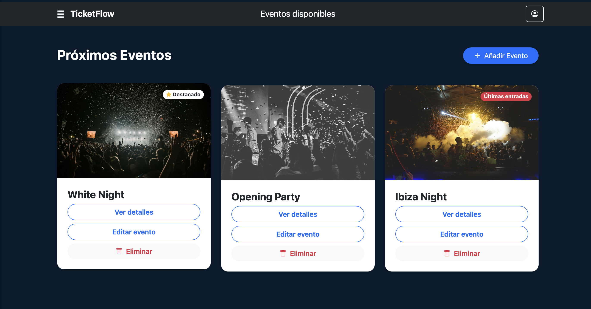
> Visualización de la oferta comercial de un evento específico (ej. "White Night"):

    - Vista de Detalle: Diseño que desglosa los diferentes tipos de pases disponibles (Early White, Main Night, White VIP) mostrando sus precios, qué incluyen (copas, zonas VIP) y botones de gestión.

    - Gestión de Ticketing: Maquetas de los formularios para crear o modificar las condiciones de acceso y el coste de cada tipo de entrada.

#### **9. Creación y Edición de Eventos**
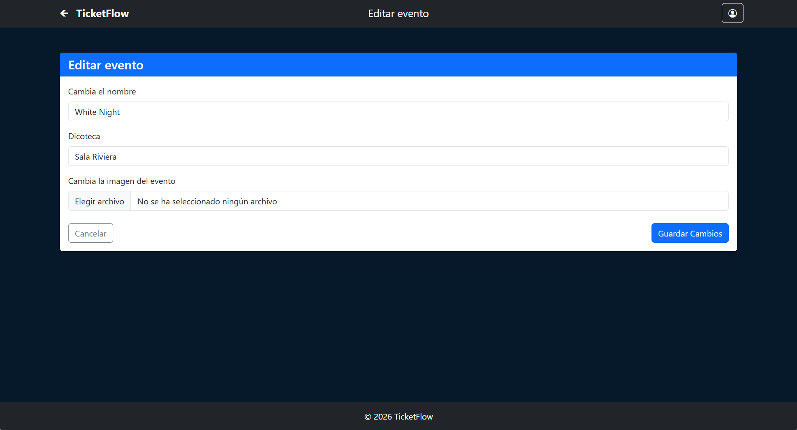 
> Interfaces diseñadas para la planificación de fiestas. Permiten simular la vinculación de un evento a una discoteca existente del listado y la subida de la imagen promocional o cartel del evento.

### **Participación de Miembros en la Práctica 1**

#### **Alumno 1 - Lázaro Martínez Medina**

[Descripción de las tareas y responsabilidades principales del alumno en el proyecto]

| Nº    |                                                                       Commits                                                                        |                                                                                                                                                                                                                        Files                                                                                                                                                                                                                         |
|:------------: |:----------------------------------------------------------------------------------------------------------------------------------------------------:|:----------------------------------------------------------------------------------------------------------------------------------------------------------------------------------------------------------------------------------------------------------------------------------------------------------------------------------------------------------------------------------------------------------------------------------------------------:|
|1| [nueva pagina html par entradas y algunas correciones](https://github.com/DWS-2026/project-grupo-17/commit/0ac3bb4a2b873f2e4c189ef473724d7a4be9ba9f) |      [entradas.html](ProyectoTicketFlow/entradas.html) <br/> [create-event.html](ProyectoTicketFlow/create-event.html) <br/> [edit-profile.html](ProyectoTicketFlow/edit-profile.html) <br/> [profile.html](ProyectoTicketFlow/profile.html) <br/> [index.html](ProyectoTicketFlow/index.html) <br/> [styles.css](css/styles.css) <br/> [register.html](ProyectoTicketFlow/register.html) <br/> [eventos.html](ProyectoTicketFlow/eventos.html)      |
|2|                   [Create style.css](https://github.com/DWS-2026/project-grupo-17/commit/5b498e9897862715670eb716a698759fbca620c5)                   |                                                                                                                                                                                                             [styles.css](css/styles.css)                                                                                                                                                                                                             |
|3|            [titles edition, new background](https://github.com/DWS-2026/project-grupo-17/commit/b1462c3b9074cdc0272e4d86b59655af3182e965)            |                                                                           [index.html](ProyectoTicketFlow/index.html) <br/> [info.html](ProyectoTicketFlow/info.html) <br/> [login.html](ProyectoTicketFlow/login.html) <br/> [register.html](ProyectoTicketFlow/register.html) <br/> [register.html](ProyectoTicketFlow/register.html) <br/> [styles.css](css/styles.css)                                                                           |
|4|                 [actualizacion index](https://github.com/DWS-2026/project-grupo-17/commit/fc518e35ca97290e1fcc43b2f80703502c503ceb)                  |                                                                                                                                                                                                     [index.html](ProyectoTicketFlow/index.html)                                                                                                                                                                                                      |
|5|                                                      [actualizacion ruta del css](https://github.com/DWS-2026/project-grupo-17/commit/20b7bd502d6880fa42edf475ea6ce40fdd84ba0c)                                                      |                                                                                                [admin.html](ProyectoTicketFlow/admin.html) <br/> [edit-profile.html](ProyectoTicketFlow/edit-profile.html) <br/> [index.html](ProyectoTicketFlow/index.html) <br/> [profile.html](ProyectoTicketFlow/profile.html) <br/> [styles.css](css/styles.css)                                                                                                |

---

#### **Alumno 2 - Eduardo Narros Sánchez**

[Descripción de las tareas y responsabilidades principales del alumno en el proyecto]

| Nº    | Commits      | Files      |
|:------------: |:------------:| :------------:|
|1| [Creación del formulario login.html] (https://github.com/DWS-2026/project-grupo-17/commit/0402417b0ccca0fb6d4e81b7363366a6c2f7f353)  | [login.html](ProyectoTicketFlow/login.html)   |
|2| [Creación de admin.html] (https://github.com/DWS-2026/project-grupo-17/commit/0b7e4923355daff11c6cb6f2b53aad2eea6df95e)  | [admin.html](ProyectoTicketFlow/admin.html)   |
|3| [Conexión entre index.html y profile.html] (https://github.com/DWS-2026/project-grupo-17/commit/933b0bac9ea1c46044fe27c9e6bd49dc1516c97f)  | [index.html](ProyectoTicketFlow/index.html)   |
|4| [Añadir ubicación clickable] (https://github.com/DWS-2026/project-grupo-17/commit/63b99d63b0b62ccfb59e924adc0b7fa8906d2b0c)  | [index.html](ProyectoTicketFlow/index.html)   |
|5| [Primer modelaje de edit-profile.html] (https://github.com/DWS-2026/project-grupo-17/commit/47c269099884816def2d16b974c88389c0bb36fd)  | [edit-profile.html](ProyectoTicketFlow/edit-profile.html)   |

---

#### **Alumno 3 - Pablo Leis**

[Descripción de las tareas y responsabilidades principales del alumno en el proyecto]

| Nº    | Commits      | Files      |
|:------------: |:------------:| :------------:|
|1| [Creacion del index.html](https://github.com/DWS-2026/dws-2026-project-base/commit/911f8dd3f196b96567c1eaabf83388877b351250)  | [index.html](ProyectoTicketFlow/index.html)   |
|2| [Creacion del html de la edicion del perfil ](https://github.com/DWS-2026/dws-2026-project-base/commit/c89c0ef87e18797c5fbd09df253b200c3e83a188)  | [ProyectoTicketFlow/edit-profile.html](URL_archivo_2)   |
|3| [Añadir los proximos eventos en el index.html](https://github.com/DWS-2026/dws-2026-project-base/commit/65013f5e723f7c315198a46d76a312df05b125e6)  | [index.html](ProyectoTicketFlow/index.html)   |
|4| [Cambio de edit-profile y he creado una pagina para crear discotecas](https://github.com/DWS-2026/dws-2026-project-base/commit/10b4f46e26c8a74c54ecb1530c13ee44accc69c1)  | [discotecas.html](ProyectoTicketFlow/discotecas.html)   |
|5| [He reestructurado la navegacion de la pagina y he añadido dos html para editar tanto los eventos como las discotecas](https://github.com/DWS-2026/dws-2026-project-base/commit/7db76f52a42b8446c6f1288241ae3ddfa93a6a4a)  | [edit-discoteca edit-evento](ProyectoTicketFlow/edit-discoteca.html / ProyectoTicketFlow/edit-evento.html)   |

---

#### **Alumno 4 - [Alejandro Cabello Manzanero]**

[Descripción de las tareas y responsabilidades principales del alumno en el proyecto]

| Nº |                                 Commits                                  |                                                     Files                                                      |
|:--:|:------------------------------------------------------------------------:|:--------------------------------------------------------------------------------------------------------------:|
| 1  |                [Creación de register.html](https://github.com/DWS-2026/dws-2026-project-base/commit/c7982c187b0f5c29d638be75919cf6d3ad77f445) |   [register.html](ProyectoTicketFlow/register.html)                                |
| 2  |                 [Creación de profile.html](https://github.com/DWS-2026/dws-2026-project-base/commit/ac68209714f1dfd304a4a035b810fd76c7e16c70) |     [profile.html](ProyectoTicketFlow/profile.html)                                 |
| 3  |                 [Creación de eventos.html](https://github.com/DWS-2026/dws-2026-project-base/commit/3f852cf0ffabfce8626d5fafcceb2757013a23d4)  |    [eventos.html](ProyectoTicketFlow/eventos.html)                                 |
| 4  | [Creación de formularios como el de crear o editar evento](https://github.com/DWS-2026/dws-2026-project-base/commit/7bb705dcb81da375daa70524e053e0a50de7fe55) |  [create-event](ProyectoTicketFlow/create-event.html)  <br> [edit-event](ProyectoTicketFlow/edit-event.html)   |
| 5  |  [Creación de formularios para crear o editar entradas ](https://github.com/DWS-2026/dws-2026-project-base/commit/36c0749676dfda11dc1e686accc34d9a8470e0af)   | [create-ticket](ProyectoTicketFlow/create-ticket.html)  <br>[edit-ticket](ProyectoTicketFlow/edit-ticket.html) |

---

## 🛠 **Práctica 2: Web con HTML generado en servidor**

### **Vídeo de Demostración**
📹 **[Enlace al vídeo en YouTube](https://youtu.be/7f5-w5AV2Vk)**
> Vídeo mostrando las principales funcionalidades de la aplicación web.

### **Navegación y Capturas de Pantalla**

#### **Diagrama de Navegación**


> Hemos actualizado el diagrama de navegación ya que hemos añadido alguna vista más. También lo hemos mejorado respecto a la primera entrega.

#### **Capturas de Pantalla Actualizadas**

Solo si han cambiado.

### **Instrucciones de Ejecución**

#### **Requisitos Previos**
- **Java**: versión 21 o superior
- **Maven**: versión 3.8 o superior
- **MySQL**: versión 8.0 o superior
- **Git**: para clonar el repositorio

#### **Pasos para ejecutar la aplicación**

1. **Clonar el repositorio**
   ```bash
   git clone https://github.com/DWS-2026/project-grupo-17.git
   cd project-grupo-17
   ```

2. **Crear la base de datos en MySQL**
```bash
CREATE DATABASE ticketflow;
```
3. **Ejecutar la aplicación**
```bash
./mvnw spring-boot:run
```
4. **Abrir en el navegador**
```bash
https://localhost:8443
```

#### **Credenciales de prueba**

Usuario Admin: * Usuario: Admin User

Email: admin@example.com

Contraseña: admin

Roles: USER, ADMIN

Usuario Registrado 1: * Usuario: Juan García

Email: juan@example.com

Contraseña: 12345

Roles: USER

Usuario Registrado 2: * Usuario: María López

Email: maria@example.com

Contraseña: password123

Roles: USER

### **Diagrama de Entidades de Base de Datos**

Diagrama mostrando las entidades, sus campos y relaciones:

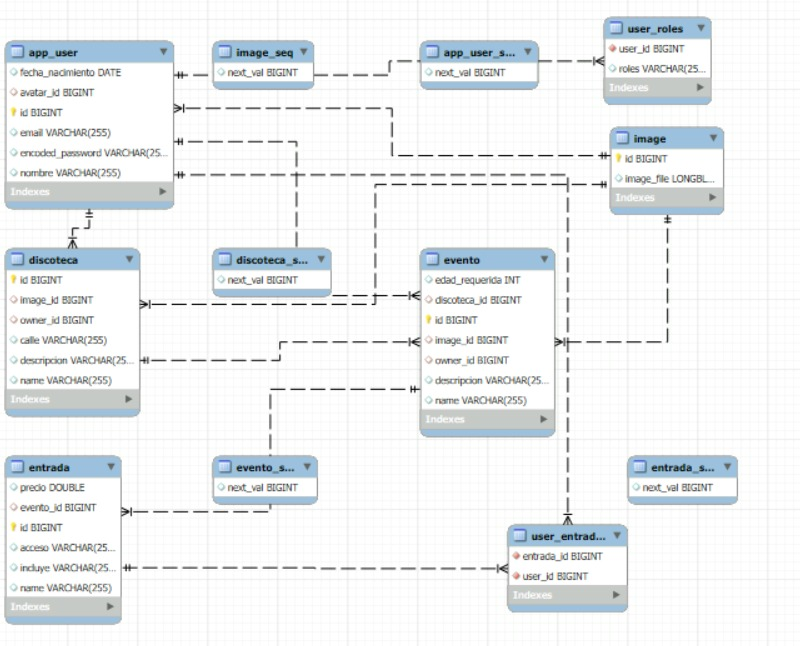


### **Diagrama de Clases y Templates**

Diagrama de clases de la aplicación con diferenciación por colores o secciones:

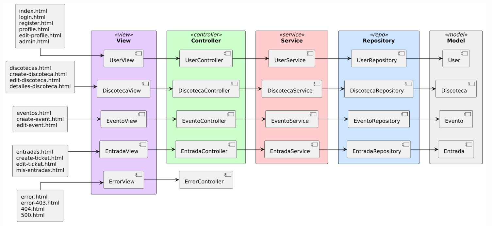


### **Participación de Miembros en la Práctica 2**

#### **Alumno 1 - Lázaro Martínez Medina**

[Descripción de las tareas y responsabilidades principales del alumno en el proyecto]

| Nº    |                                                                    Commits                                                                    |                                                                                                                                                                                                                                                                                                                                                                                                                                                                                                                                   Files                                                                                                                                                                                                                                                                                                                                                                                                                                                                                                                                   |
|:------------: |:---------------------------------------------------------------------------------------------------------------------------------------------:|:-------------------------------------------------------------------------------------------------------------------------------------------------------------------------------------------------------------------------------------------------------------------------------------------------------------------------------------------------------------------------------------------------------------------------------------------------------------------------------------------------------------------------------------------------------------------------------------------------------------------------------------------------------------------------------------------------------------------------------------------------------------------------------------------------------------------------------------------------------------------------------------------------------------------------------------------------------------------------------------------------------------------------------------------------------------------------:|
|1|           [Best sellers en el index](https://github.com/DWS-2026/project-grupo-17/commit/178cf63700a5718f8291779e3b9961cdb14ecd83)            |                                                                                                                                                                                                                                                                     [UserController.java](ProyectTicketFlow/src/main/java/es/codeurjc/board/controller/UserController.java)  <br>[EventoRepository.java](ProyectTicketFlow/src/main/java/es/codeurjc/board/repositories/EventoRepository.java) <br>[DatabaseInitializer.java](ProyectTicketFlow/src/main/java/es/codeurjc/board/service/DatabaseInitializer.java) <br>[EventoService.java](ProyectTicketFlow/src/main/java/es/codeurjc/board/service/EventoService.java) <br>[index.html](ProyectTicketFlow/src/main/resources/templates/index.html)                                                                                                                                                                                                                                                                      |
|2|        [Entidad imagen y sus derivados](https://github.com/DWS-2026/project-grupo-17/commit/6869e09663fce22e2fcb35a2005e68ee3591bf0c)         | [DiscotecaController.java](ProyectTicketFlow/src/main/java/es/codeurjc/board/controller/DiscotecaController.java)  <br>[ImageController.java](ProyectTicketFlow/src/main/java/es/codeurjc/board/controller/ImageController.java) <br>[Discoteca.java](ProyectTicketFlow/src/main/java/es/codeurjc/board/model/Discoteca.java) <br>[Image.java](ProyectTicketFlow/src/main/java/es/codeurjc/board/model/Image.java) <br>[ImageRepository.java](ProyectTicketFlow/src/main/java/es/codeurjc/board/repositories/ImageRepository.java) <br>[DatabaseInitializer.java](ProyectTicketFlow/src/main/java/es/codeurjc/board/service/DatabaseInitializer.java) <br>[DiscotecaService.java](ProyectTicketFlow/src/main/java/es/codeurjc/board/service/DiscotecaService.java) <br>[ImageService.java](ProyectTicketFlow/src/main/java/es/codeurjc/board/service/ImageService.java) <br>[create-discotecas.html](ProyectTicketFlow/src/main/resources/templates/create-discotecas.html) <br>[edit-discoteca.html](ProyectTicketFlow/src/main/resources/templates/edit-discoteca.html) |
|3|   [Error de encoder de contraseña arreglado](https://github.com/DWS-2026/project-grupo-17/commit/0e36a0386403168d0fe36c184b95cb357f273aab)    |                                                                                                                                                                                                                                                                                                                                                                                                                                                                                      [UserService.java](ProyectTicketFlow/src/main/java/es/codeurjc/board/service/UserService.java)                                                                                                                                                                                                                                                                                                                                                                                                                                                                                       |
|4|             [Eventos inicializados](https://github.com/DWS-2026/project-grupo-17/commit/de629e5a71816a0fc52386cfaa2b71d74588cf56)             |                                                                                                                                                                                                                                                                        [EventoController.java](ProyectTicketFlow/src/main/java/es/codeurjc/board/controller/EventoController.java) <br>[DatabaseInitializer.java](ProyectTicketFlow/src/main/java/es/codeurjc/board/service/DatabaseInitializer.java) <br>[Discoteca.java](ProyectTicketFlow/src/main/java/es/codeurjc/board/model/Discoteca.java)  <br>[EventoService.java](ProyectTicketFlow/src/main/java/es/codeurjc/board/service/EventoService.java)  <br>[Evento.java](ProyectTicketFlow/src/main/java/es/codeurjc/board/model/Evento.java)                                                                                                                                                                                                                                                                        |
|5| [Avatar default para usuarios ya inicializados](https://github.com/DWS-2026/project-grupo-17/commit/bd47043a5b52fc48e2d0c8759bcfee1a2431a621) |                                                                                                                                                                                                                                                                                                                                                                          [UserController.java](ProyectTicketFlow/src/main/java/es/codeurjc/board/controller/UserController.java) <br>[User.java](ProyectTicketFlow/src/main/java/es/codeurjc/board/model/User.java) <br>[DatabaseInitializer.java](ProyectTicketFlow/src/main/java/es/codeurjc/board/service/DatabaseInitializer.java) <br>[UserService.java](ProyectTicketFlow/src/main/java/es/codeurjc/board/service/UserService.java)    <br>[profile.html](ProyectTicketFlow/src/main/resources/templates/profile.html)                                                                                                                                                                                                                                                                                                                                                                        |

---

#### **Alumno 2 - Eduardo Narros Sánchez**

[Descripción de las tareas y responsabilidades principales del alumno en el proyecto]

| Nº    | Commits      | Files      |
|:------------: |:------------:| :------------:|
|1| [Primer diseño de EventoController](https://github.com/DWS-2026/project-grupo-17/commit/386075e2d79e0cd8833ac502519c7a85908a9d6c)  | [EventoController.java](ProyectTicketFlow/src/main/java/es/codeurjc/board/controller/EventoController.java)   |
|2| [Primer diseño de seguridad con spring](https://github.com/DWS-2026/project-grupo-17/commit/72cc1f5b8bf6becfa43d488300c94632ff5fe35a#diff-970c32efad32a670394e4f89ea15fa090ebedda71a63e3733518f7cc7f46914f)  | [Security](ProyectTicketFlow/src/main/java/es/codeurjc/board/security)   |
|3| [Botón ver perfil en el listado de usuarios que ve el admin](https://github.com/DWS-2026/project-grupo-17/commit/399e4cb96e938fe12cac29350148b8a09191bad3)  | [UserDTO.java](ProyectTicketFlow/src/main/java/es/codeurjc/board/UserDTO.java)  <br>[UserController.java](ProyectTicketFlow/src/main/java/es/codeurjc/board/controller/UserController.java) <br>[SecurityConfig.java](ProyectTicketFlow/src/main/java/es/codeurjc/board/security/SecurityConfig.java) <br>[admin.html](ProyectTicketFlow/src/main/resources/templates/admin.html) <br>[profile.html](ProyectTicketFlow/src/main/resources/templates/profile.html) |
|4| [Paginas para error 403, 404 y 500](https://github.com/DWS-2026/project-grupo-17/commit/c7ab8e7982cad10eea1f21b38ba6a45ed2e13c80)  | [ErrorController.java](ProyectTicketFlow/src/main/java/es/codeurjc/board/controller/ErrorController.java) <br>[GlobalExceptionHandler.java](ProyectTicketFlow/src/main/java/es/codeurjc/board/controller/GlobalExceptionHandler.java) <br>[SecurityConfig.java](ProyectTicketFlow/src/main/java/es/codeurjc/board/security/SecurityConfig.java) <br>[404.html](ProyectTicketFlow/src/main/resources/templates/404.html) <br>[500.html](ProyectTicketFlow/src/main/resources/templates/500.html) <br>[error-403.html](ProyectTicketFlow/src/main/resources/templates/error-403.html) <br>[error.html](ProyectTicketFlow/src/main/resources/templates/error.html) |
|5| [Añadir validación en servidor a todos los formularios de creación y edición](https://github.com/DWS-2026/project-grupo-17/commit/9661c09de63c0c519a41121b11c0d2ccda3c536c)  | [DiscotecaController.java](ProyectTicketFlow/src/main/java/es/codeurjc/board/controller/DiscotecaController.java) <br> [EntradaController.java](ProyectTicketFlow/src/main/java/es/codeurjc/board/controller/EntradaController.java) <br> [EventoController.java](ProyectTicketFlow/src/main/java/es/codeurjc/board/controller/EventoController.java) <br> [UserController.java](ProyectTicketFlow/src/main/java/es/codeurjc/board/controller/UserController.java) <br> [create-discotecas.html](ProyectTicketFlow/src/main/resources/templates/create-discotecas.html) <br> [create-event.html](ProyectTicketFlow/src/main/resources/templates/create-event.html)  <br> [create-ticket.html](ProyectTicketFlow/src/main/resources/templates/create-ticket.html) <br> [edit-discoteca.html](ProyectTicketFlow/src/main/resources/templates/edit-discoteca.html) <br> [edit-event.html](ProyectTicketFlow/src/main/resources/templates/edit-event.html) <br> [edit-profile.html](ProyectTicketFlow/src/main/resources/templates/edit-profile.html) <br> [edit-ticket.html](ProyectTicketFlow/src/main/resources/templates/edit-ticket.html) |

---

#### **Alumno 3 - Pablo Leis Aguado**

[Descripción de las tareas y responsabilidades principales del alumno en el proyecto]

| Nº    | Commits      | Files      |
|:------------: |:------------:| :------------:|
|1| [He añadido 2 atributos en Discoteca, ademas he cambiado el servicio, el controller y he añadido un boton de detalle de la discoteca](https://github.com/DWS-2026/dws-2026-project-base/commit/4c4d20137a4c2aa50eb915f9bc6ecb913c114ce0) | [DiscotecaController.java](https://www.google.com/search?q=ProyectTicketFlow/src/main/java/es/codeurjc/board/controller/DiscotecaController.java) <br> [Discoteca.java](https://www.google.com/search?q=ProyectTicketFlow/src/main/java/es/codeurjc/board/model/Discoteca.java) <br> [DiscotecaService.java](https://www.google.com/search?q=ProyectTicketFlow/src/main/java/es/codeurjc/board/service/DiscotecaService.java) <br> [create-discotecas.html](https://www.google.com/search?q=ProyectTicketFlow/src/main/resources/templates/create-discotecas.html) <br> [detalles-discoteca.html](https://www.google.com/search?q=ProyectTicketFlow/src/main/resources/templates/detalles-discoteca.html) <br> [discotecas.html](https://www.google.com/search?q=ProyectTicketFlow/src/main/resources/templates/discotecas.html) |
|2| [Gestión inicial de Entradas: Repositorio, Modelo, Servicio y Controlador](https://github.com/DWS-2026/dws-2026-project-base/commit/7837d96fb01bfbd58c5271de1010c4a62e608ff5) | [EntradaController.java](https://www.google.com/search?q=ProyectTicketFlow/src/main/java/es/codeurjc/board/controller/EntradaController.java) <br> [Entrada.java](https://www.google.com/search?q=ProyectTicketFlow/src/main/java/es/codeurjc/board/model/Entrada.java) <br> [EntradaService.java](https://www.google.com/search?q=ProyectTicketFlow/src/main/java/es/codeurjc/board/service/EntradaService.java) <br> [EntradaRepository.java](https://www.google.com/search?q=ProyectTicketFlow/src/main/java/es/codeurjc/board/repositories/EntradaRepository.java) |
|3| [Cambias de entradas + seguridad (mejora implementada)](https://github.com/DWS-2026/dws-2026-project-base/commit/86d6a69d97dfa0b1624923ede9920f00c2d29946) | [DiscotecaController.java](https://www.google.com/search?q=ProyectTicketFlow/src/main/java/es/codeurjc/board/controller/DiscotecaController.java) <br> [EntradaController.java](https://www.google.com/search?q=ProyectTicketFlow/src/main/java/es/codeurjc/board/controller/EntradaController.java) <br> [EventoController.java](https://www.google.com/search?q=ProyectTicketFlow/src/main/java/es/codeurjc/board/controller/EventoController.java) <br> [UserController.java](https://www.google.com/search?q=ProyectTicketFlow/src/main/java/es/codeurjc/board/controller/UserController.java) <br> [GlobalExceptionHandler.java](https://www.google.com/search?q=ProyectTicketFlow/src/main/java/es/codeurjc/board/controller/GlobalExceptionHandler.java) <br> [SecurityConfig.java](https://www.google.com/search?q=ProyectTicketFlow/src/main/java/es/codeurjc/board/security/SecurityConfig.java) <br> [create-ticket.html](https://www.google.com/search?q=ProyectTicketFlow/src/main/resources/templates/create-ticket.html) <br> [edit-ticket.html](https://www.google.com/search?q=ProyectTicketFlow/src/main/resources/templates/edit-ticket.html) <br> [entradas.html](https://www.google.com/search?q=ProyectTicketFlow/src/main/resources/templates/entradas.html) |
|4| [Configuración de aplicación, inicialización de base de datos y gestión de sesión de usuario](https://github.com/DWS-2026/dws-2026-project-base/commit/5599cd27bdac3c9be620399cad94ab4d7b303175) | [Application.java](https://www.google.com/search?q=ProyectTicketFlow/src/main/java/es/codeurjc/board/Application.java) <br> [UserSession.java](https://www.google.com/search?q=ProyectTicketFlow/src/main/java/es/codeurjc/board/service/UserSession.java) <br> [DatabaseInitializer.java](https://www.google.com/search?q=ProyectTicketFlow/src/main/java/es/codeurjc/board/service/DatabaseInitializer.java) <br> [profile.html](https://www.google.com/search?q=ProyectTicketFlow/src/main/resources/templates/profile.html) |
|5| [Configuración de dependencias Maven y propiedades del entorno para cambiar la BBDD de H2 a mysql](https://github.com/DWS-2026/dws-2026-project-base/commit/67150f96b45a3e1a19a7d50725e45f7649c8bb18) | [pom.xml](https://www.google.com/search?q=ProyectTicketFlow/pom.xml) <br> [application.properties](https://www.google.com/search?q=ProyectTicketFlow/src/main/resources/application.properties) |

---

#### **Alumno 4 - [Alejandro Cabello Manzanero]**

[Descripción de las tareas y responsabilidades principales del alumno en el proyecto]

| Nº    | Commits      | Files      |
|:------------: |:------------:| :------------:|
|1| [He modificado muchas cosas del user y de la seguridad (los cambios de los html no los he incluido porque son todos)](https://github.com/DWS-2026/project-grupo-17/commit/8796ad202d10cd8f7ade6dd90e27532d8e74c69b)  | [UserDTO.java](ProyectTicketFlow/src/main/java/es/codeurjc/board/UserDTO.java) <br> [DiscotecaController.java](ProyectTicketFlow/src/main/java/es/codeurjc/board/controller/DiscotecaController.java) <br> [EntradaController.java](ProyectTicketFlow/src/main/java/es/codeurjc/board/controller/EntradaController.java) <br> [EventoController.java](ProyectTicketFlow/src/main/java/es/codeurjc/board/controller/EventoController.java) <br> [GlobalControllerAdvice.java](ProyectTicketFlow/src/main/java/es/codeurjc/board/controller/GlobalControllerAdvice.java) <br> [UserController.java](ProyectTicketFlow/src/main/java/es/codeurjc/board/controller/UserController.java) <br> [User.java](ProyectTicketFlow/src/main/java/es/codeurjc/board/model/User.java) <br> [SecurityConfig.java](ProyectTicketFlow/src/main/java/es/codeurjc/board/security/SecurityConfig.java) <br> [DiscotecaService.java](ProyectTicketFlow/src/main/java/es/codeurjc/board/service/DiscotecaService.java) <br> [EventoService.java](ProyectTicketFlow/src/main/java/es/codeurjc/board/service/EventoService.java) <br> [UserService.java](ProyectTicketFlow/src/main/java/es/codeurjc/board/service/UserService.java)|
|2| [He conseguido hacer que se puedan crear eventos asociados a una discoteca](https://github.com/DWS-2026/project-grupo-17/commit/a36e3ca4a9c2d94362fa3c417d588f6a36856910)  | [DiscotecaController.java](ProyectTicketFlow/src/main/java/es/codeurjc/board/controller/DiscotecaController.java) <br> [EventoController.java](ProyectTicketFlow/src/main/java/es/codeurjc/board/controller/EventoController.java) <br> [EventoService.java](ProyectTicketFlow/src/main/java/es/codeurjc/board/service/EventoService.java) <br> [create-event.html](ProyectTicketFlow/src/main/resources/templates/create-event.html) <br> [eventos.html](ProyectTicketFlow/src/main/resources/templates/eventos.html)|
|3| [entrdas.html modificado](https://github.com/DWS-2026/project-grupo-17/commit/264fa2308f41ba888a22e890438d05901f663185)  | [EntradaController.java](ProyectTicketFlow/src/main/java/es/codeurjc/board/controller/EntradaController.java) <br> [Entrada.java](ProyectTicketFlow/src/main/java/es/codeurjc/board/model/Entrada.java) <br> [EntradaService.java](ProyectTicketFlow/src/main/java/es/codeurjc/board/service/EntradaService.java) <br> [create-ticket.html](ProyectTicketFlow/src/main/resources/templates/create-ticket.html) <br> [edit-ticket.html](ProyectTicketFlow/src/main/resources/templates/edit-ticket.html) |
|4| [He cañadido el eventoRepository y el EventoService](https://github.com/DWS-2026/project-grupo-17/commit/19c1e869b45c3f25795c81e6bb7afe541f767c45)  | [EventoRepository.java](ProyectTicketFlow/src/main/java/es/codeurjc/board/repositories/EventoRepository.java) <br> [EventoService.java](ProyectTicketFlow/src/main/java/es/codeurjc/board/service/EventoService.java)   |
|5| [he arreglado la entidad discoteca para que funcione correctamente con la entidad evento](https://github.com/DWS-2026/project-grupo-17/commit/ae21725c6d36c1366d0ab02745f8cd61ff8461a9)  | [DiscotecaController.java](ProyectTicketFlow/src/main/java/es/codeurjc/board/controller/DiscotecaController.java) <br> [Discoteca.java](ProyectTicketFlow/src/main/java/es/codeurjc/board/model/Discoteca.java) <br> [DiscotecaService.java](ProyectTicketFlow/src/main/java/es/codeurjc/board/service/DiscotecaService.java) |

---

## 🛠 **Práctica 3: Incorporación de una API REST a la aplicación web, análisis de vulnerabilidades y contramedidas**

### **Vídeo de Demostración**
📹 **[Enlace al vídeo en YouTube](https://www.youtube.com/watch?v=x91MPoITQ3I)**
> Vídeo mostrando las principales funcionalidades de la aplicación web.

### **Documentación de la API REST**

#### **Especificación OpenAPI**
📄 **[Especificación OpenAPI (YAML)](/api-docs/api-docs.yaml)**

#### **Documentación HTML**
📖 **[Documentación API REST (HTML)](https://raw.githack.com/[usuario]/[repositorio]/main/api-docs/api-docs.html)**

> La documentación de la API REST se encuentra en la carpeta `/api-docs` del repositorio. Se ha generado automáticamente con SpringDoc a partir de las anotaciones en el código Java.

### **Diagrama de Clases y Templates Actualizado**

Diagrama actualizado incluyendo los @RestController y su relación con los @Service compartidos:


#### **Credenciales de Usuarios de Ejemplo**

| Rol | Usuario | Contraseña |
|:---|:---|:---|
| Administrador | admin | admin123 |
| Usuario Registrado | user1 | user123 |
| Usuario Registrado | user2 | user123 |

### **Participación de Miembros en la Práctica 3**

#### **Alumno 1 - [Nombre Completo]**

[Descripción de las tareas y responsabilidades principales del alumno en el proyecto]

| Nº    | Commits      | Files      |
|:------------: |:------------:| :------------:|
|1| [Descripción commit 1](URL_commit_1)  | [Archivo1](URL_archivo_1)   |
|2| [Descripción commit 2](URL_commit_2)  | [Archivo2](URL_archivo_2)   |
|3| [Descripción commit 3](URL_commit_3)  | [Archivo3](URL_archivo_3)   |
|4| [Descripción commit 4](URL_commit_4)  | [Archivo4](URL_archivo_4)   |
|5| [Descripción commit 5](URL_commit_5)  | [Archivo5](URL_archivo_5)   |

---

#### **Alumno 2 - [Nombre Completo]**

[Descripción de las tareas y responsabilidades principales del alumno en el proyecto]

| Nº    | Commits      | Files      |
|:------------: |:------------:| :------------:|
|1| [Descripción commit 1](URL_commit_1)  | [Archivo1](URL_archivo_1)   |
|2| [Descripción commit 2](URL_commit_2)  | [Archivo2](URL_archivo_2)   |
|3| [Descripción commit 3](URL_commit_3)  | [Archivo3](URL_archivo_3)   |
|4| [Descripción commit 4](URL_commit_4)  | [Archivo4](URL_archivo_4)   |
|5| [Descripción commit 5](URL_commit_5)  | [Archivo5](URL_archivo_5)   |

---

#### **Alumno 3 - [Nombre Completo]**

[Descripción de las tareas y responsabilidades principales del alumno en el proyecto]

| Nº    | Commits      | Files      |
|:------------: |:------------:| :------------:|
|1| [Descripción commit 1](URL_commit_1)  | [Archivo1](URL_archivo_1)   |
|2| [Descripción commit 2](URL_commit_2)  | [Archivo2](URL_archivo_2)   |
|3| [Descripción commit 3](URL_commit_3)  | [Archivo3](URL_archivo_3)   |
|4| [Descripción commit 4](URL_commit_4)  | [Archivo4](URL_archivo_4)   |
|5| [Descripción commit 5](URL_commit_5)  | [Archivo5](URL_archivo_5)   |

---

#### **Alumno 4 - [Nombre Completo]**

[Descripción de las tareas y responsabilidades principales del alumno en el proyecto]

| Nº    | Commits      | Files      |
|:------------: |:------------:| :------------:|
|1| [Descripción commit 1](URL_commit_1)  | [Archivo1](URL_archivo_1)   |
|2| [Descripción commit 2](URL_commit_2)  | [Archivo2](URL_archivo_2)   |
|3| [Descripción commit 3](URL_commit_3)  | [Archivo3](URL_archivo_3)   |
|4| [Descripción commit 4](URL_commit_4)  | [Archivo4](URL_archivo_4)   |
|5| [Descripción commit 5](URL_commit_5)  | [Archivo5](URL_archivo_5)   |
